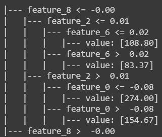

# Деревья решений
Дерево решений — это метод представления решающих правил в иерархической структуре, состоящей из элементов двух типов — узлов (node) и листьев (leaf). Представляет собой дерево, в котором каждый узел соответствует определенному признаку, а ветви - его возможным значениям.
## Алгоритм 
Алгоритм обучения упрощённо можно описать следующим образом:

* Проверяем критерий остановки
* Строим всевозможные разбиения на две подвыборки по одному признаку
* Выбираем лучшее разбиение
* Возвращаемся к шагу 0 для потомков
* Проводим отсечение (pruning)
## Модель
### Для классификации
```python
from sklearn.tree import DecisionTreeClassifier 
```
```python
clf = DecisionTreeClassifier(max_depth=3) # модель дерева решений с максимальной глубиной 3
clf.fit(X, y) # обучение модели
```
### Для регрессии
```python
from sklearn.tree import DecisionTreeRegressor 
```
```python
clf = DecisionTreeRegressor(max_depth=3) # модель дерева решений с максимальной глубиной 3
clf.fit(X, y) # обучение модели
```

### Гиперпараметры

***criterion:*** критерий, используемый для измерения качества разделения. Для классификации обычно используются "gini" или "entropy".
Для регрессии обычно используется среднеквадратическая ошибка ("mse").

***max_depth:*** максимальная глубина дерева. Ограничение на глубину позволяет предотвратить переобучение модели и улучшить её обобщающую способность.

***min_samples_split:*** минимальное количество выборок, необходимое для деления узла. Установка этого параметра помогает предотвратить создание узлов с недостаточным количеством выборок, что может привести к переобучению.

***min_samples_leaf:*** минимальное количество выборок в листьях дерева. Этот параметр позволяет контролировать размер листьев, что также помогает предотвратить переобучение.

***max_features:*** количество признаков, которые следует использовать при поиске наилучшего разбиения.

### Визуализация деревьев

#### Текстовая визуализация
```python
from sklearn import tree

text_representation = tree.export_text(clf) # сюда кладем нашу модель(регрессия или классификация)
print(text_representation)
```

Вот так будет выглядеть для классификации:


Вот так для регрессии:



### С помощью matplotlib

```python
from matplotlib import pyplot as plt

fig = plt.figure(figsize=(25,20))
# для классификации
_ = tree.plot_tree(clf, feature_names=iris.feature_names, class_names=iris.target_names, filled=True) # здесь первый аргумент модель, второй - признаки, третий - метки классов

# для регрессии
_ = tree.plot_tree(reg, feature_names=diab.feature_names, filled=True)  # первый аргумент - модель, второй - имена признаков
```

