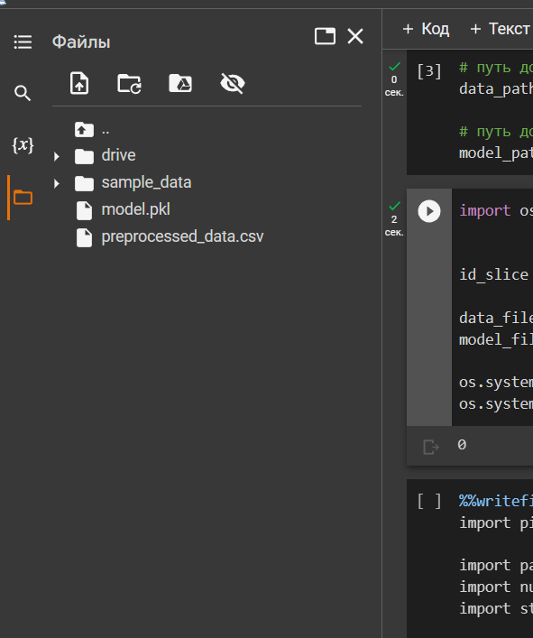

# Запуск streamlit-дашборда через колаб

На случай если реально придётся через колаб запускать стримлит пишу эту страничку потому что тут какие-то темки хитрые вообще, а я всегда через юпитер делал

### Установка зависимостей
```
!pip install -q numpy pandas scikit-learn streamlit
```
### Подготовка данных и модели
Подключаем гугл-диск к рабочему окружению colab:
```python
from google.colab import drive

drive.mount('/content/drive')
```
Далее нужно правильно указать пути ко всем файлам, которые вам понадобятся в окружении (предобработанные датасеты, сериализованные модели, полученные на каких-то предыдущих шагах..... короче всё что вам понадобится для реализации функционала дашборда..... причём важно что оно лежит именно на гугл диске). В примере это выглядит так
```python
# путь до файла с предобработанными данными в формате csv
data_path = "https://drive.google.com/file/d/1Zm8viieM23EaHQ5kU9atdnLUm72HDd2H/view?usp=share_link"

# путь до файла с сериализованной моделью
model_path = "https://drive.google.com/file/d/1s9F0BJE2tKFVkDth5dO7FHkLa0MfH2ab/view?usp=share_link"
```
Если перейти по ссылкам, можно увидеть, что это всего-лишь ссылки для открытия доступа к файлу на гугл диске. В случае с вашим файлом на диске 1) открываем файл 2) в правом верхнем углу меню 3) открыть доступ;
если такой меню нет думаю можно не париться и просто ссылку из адресной строки влепить;

Файлов можно загрузить и больше, просто пути добавляем по аналогии
**Далее**:
```python
import os


id_slice = slice(32, 65)

data_file_id = data_path[id_slice]
model_file_id = model_path[id_slice]

os.system(f"wget -q -O preprocessed_data.csv https://drive.google.com/uc?id={data_file_id}")
os.system(f"wget -q -O model.pkl https://drive.google.com/uc?id={model_file_id}")
```

Эта ячейка кода непосредственно качает с гуглдиска файлы и добавляет их в вирутальное окружение. Можно убедиться что они там появились, в меню что слева, куда обычно напрямую загружаются файлы


### Альтернативный способ

**Наверное**, можно эти файлы скачать на комп и просто ручками загрузить в окружение. Еслиб я знал чё там на экзамене будет я консультацию проспал прост вообще

### Дальше

Есть вот такой пример
```python
%writefile app.py
import streamlit as st
import numpy as np
import pandas as pd

def main():
    model = load_model("model.pkl")
    test_data = load_test_data("preprocessed_data.csv")
    
    page = st.sidebar.selectbox(
        "Выберите страницу",
        ["Описание задачи и данных", "Запрос к модели"]
    )

    if page == "Описание задачи и данных":
        st.title("Описание задачи и данных")
        st.write("Выберите страницу слева")

        st.header("Описание задачи")
        st.markdown("""Розничная компания «ABC Private Limited» хочет понять покупательское поведение (в частности, сумму покупки) по отношению к различным продуктам разных категорий. Они поделились сводкой покупок различных клиентов для избранных продуктов большого объема за последний месяц.
Набор данных также содержит демографические данные клиентов, сведения о продукте и общую сумму покупки за последний месяц. 
Теперь они хотят построить модель для прогнозирования количества покупок клиентов по различным продуктам, которая поможет им создавать персонализированные предложения для клиентов по разным продуктам.""")

        st.header("Описание данных")
        st.markdown("""Предоставленные данные:
* User_ID – идентификатор покупателя,
* Product_ID – идентификатор продукта,
* Age – возраст покупателя,
* Occupation – профессия покупателя,
* City_Category – категория города,
* Stay_In_Current_City_Years – количество лет пребывания покупателя в текущем городе,
* Marital_Status – семейное положение покупателя,
* Product_Category_1 – первая категория продукта,
* Product_Category_2 – вторая категория продукта при ее наличии,
* Product_Category_3 – третья категория продукта при ее наличии,
* Purchase – сумма покупки.
К категориальным признакам относятся:
* пол покупателя принимает значения M, F, где значение M означает мужской пол, а значение F – женский пол;
* возраст покупателя принимает значения 0-17, 18-25, 26-35, 36-45, 46-50, 51-55, 55+;
* профессия покупателя принимает значения от 0 до 20, где значение 0 означает отсутствие профессии у покупателя, остальные значения означают код профессии;
* категория города принимает значения A, B, C;
* категории продукта принимают значения кодов категорий продуктов, причем продукт всегда имеет хотя бы одну категорию и ее значение записывается в признаке Product_Category_1, если продукт относится еще к каким-либо категориям, то код таких категорий записывается в признаках Product_Category_2 и Product_Category_3 соответственно.
К порядковым признакам относится возраст покупателя, данный признак принимает значения 0-17, 18-25, 26-35, 36-45, 46-50, 51-55, 55+.
К бинарным признакам относятся:
* пол покупателя принимает значения M, F, где значение M (0) означает мужской пол, а значение F (1) – женский пол;
* семейное положение покупателя, данный признак принимает значения 0 и 1, где значение 1 означает, что покупатель состоит в браке, значение 0 – не состоит в браке.
К вещественным признакам относятся:
* идентификатор покупателя,
* идентификатор продукта,
* сумма покупки.""")

    elif page == "Запрос к модели":
        st.title("Запрос к модели")
        st.write("Выберите страницу слева")
        request = st.selectbox(
            "Выберите запрос",
            ["RMSE", "Первые 5 предсказанных значений", "Пользовательский пример", "Пасхалка"]
        )

        if request == "RMSE":
            st.header("Корень из среднеквадратичной ошибки")
            rmse = 3006.55  # Костыль! Заменить на настоящий подсчёт метрики
            st.write(f"{rmse}")
        elif request == "Первые 5 предсказанных значений":
            st.header("Первые 5 предсказанных значений")
            first_5_test = test_data.iloc[:5, :]
            first_5_pred = model.predict(first_5_test)
            for item in first_5_pred:
                st.write(f"{item:.2f}")
        elif request == "Пользовательский пример":
            st.header("Пользовательский пример")

            gender = st.selectbox("Пол", ['М', 'Ж'])
            gender = 0 if gender == 'М' else 1

            age = st.number_input("Возраст", 0, 100)
            age = 0 if age >= 55 else 1

            city = st.selectbox("Город", ['A', 'B', 'C'])
            city = 0 if city == 'C' else 1

            stay_in_city = st.selectbox("Количество лет в городе", ['1', '2', '3', '4+'])
            stay_in_city = 0 if stay_in_city == '4+' else 1

            marital_status = st.selectbox("Семейное положение (в браке - 1, иначе - 0)", [0, 1])
            marital_status = int(marital_status)

            occupation = st.number_input("Код профессии от 0 до 20", 0, 19)
            one_hot_occup = []
            for num in range(0, 20):
                if num == occupation:
                    one_hot_occup.append(1)
                else:
                    one_hot_occup.append(0)

            category = st.number_input("Категория  от 0 до 20", 0, 20)
            one_hot_cat = []
            for num in range(0, 21):
                if num == category:
                    one_hot_cat.append(1)
                else:
                    one_hot_cat.append(0)

            if st.button('Предсказать'):
                data = [gender, age, city, stay_in_city, marital_status]
                for item in one_hot_occup + one_hot_cat:
                    data.append(item)
                data = np.array(data).reshape((1, -1))
                pred = model.predict(data)
                st.write(f"Предсказанное значение: {pred[0]:.2f}")
            else:
                pass

        elif request == "Пасхалка":
            st.header("Пасхалка")
            st.write(":)")


@st.cache_data
def load_model(path_to_file):
    with open(path_to_file, 'rb') as model_file:
        model = pickle.load(model_file)
    return model


@st.cache_data
def load_test_data(path_to_file):
    df = pd.read_csv(path_to_file, index_col='Unnamed: 0')
    df = df.drop(labels=['Product_ID'], axis=1)
    return df


if __name__ == "__main__":
    main()
```

добавьте директиву %%writefile app.py только после того, как напишите весь код, чтобы была подстветка синтаксиса и ошибок.

### Запускаем

```
!npm install localtunnel
```
```
!streamlit run /content/app.py &>/content/logs.txt &
```
```
!npx localtunnel --port 8501
```

Должно появиться сообщение типа your url is: https://pink-lands-tap.loca.lt -- переходим по url.
Если выскакивает **Tunnel website ahead friendly reminder**, запускаем в колабе
```
!curl ipecho.net/plain
```

и полученный айпи вставляем на странице. Должно заработать.
Ещё как я понимаю чтобы чё то поменялось на странице это надо всю эту систему с айпи перезапускать каждый раз или чё