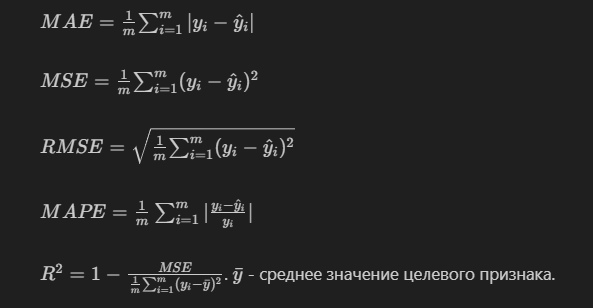

# Задача регрессии (линейная регрессия)
В задаче регрессии мы предсказываем **непрерывное значение** (действительное число). 
> Задача регрессии -- обучение с учителем.

**Общая схема решения задачи обучения с учителем выглядит следующим образом:**

- загрузка и анализ данных; выявление целевого признака (то, что мы хотим предсказывать)
- предобработка данных (заполнение пропущенных значений, преобразование - категориальных признаков);
- построение моделей с различными гиперпараметрами (подбор гиперпараметров);
- оценивание качества построенных моделей с использованием метрик; выбор лучшей модели;
- применение модели для получения предсказаний.

# Предобработка
> см. ветку 1-Preprocessing

# Линейная регрессия в sklearn
Используем LinearRegression и регуляризаторы L1 (Lasso), L2 (Ridge) (препятствуют переобучению модели)
```python
from sklearn.linear_model import LinearRegression, Lasso, Ridge
```
**Обучение. Метод fit принимает аргументы:**
X_train : array-like of shape (n_samples, n_features) -- training data.
y_train : array-like of shape (n_samples,) -- target values. Will be cast to X’s dtype if necessary.
```python
lr = LinearRegression().fit(X_train, y_train)
```
**Предсказание**
```python
lr.predict(X_test)
```
Это так называемая база. Дальше можно чекнуть метрики и ещё что-нибудь накрутить для улучшения качества модели:

# Метрики

Для оценки качетсва моделей регрессии применяются следующие метрики:
- средняя абсолютная ошибка (Mean Absolute Error, MAE);
- средняя квадратичная ошибка (Mean Squared Error, MSE);
- квадратный корень из средней квадратичной ошибки (Root Mean Squared Error);
- средняя абсолютная ошибка в процентах (Mean Absolute Percentage Error, MAPE);
- коэффициент детерминации ($R^2$).



```python
from sklearn.metrics import mean_squared_error, mean_absolute_error, mean_absolute_percentage_error
from math import sqrt
print(f'MAE: {mean_absolute_error(y_test, y_pred)}')
print(f'MSE: {mean_squared_error(y_test, y_pred)}')
print(f'RMSE: {sqrt(mean_squared_error(y_test, y_pred))}')
print(f'MAPE: {sqrt(mean_absolute_percentage_error(y_test, y_pred))}')
print(f'R^2: {lr.score(X_test, y_test)}')
```

-
# Регуляризации
Регуляризация - это наложение дополнительных ограничений на значения переменных (весов) -- неявное ограничение добавляется непосредственно в целевую функцию. Цель регуляризации - предотвращение так называемого переобучения.

Переобучение заключается в том, что долгое и точное обучение модели на одних данных может привести к получению крайне плохих предсказаний на отличающихся данных.

Регуляризация L1 более агрессивно снижает веса "незначительных", а также коллинеарных (сильно коррелирующих, а значит, некоторые из набора этих зависимых признаков могут быть удалены без потери информации) признаков, приводя их значения кк нулю, так что её использование полезно при излишне большой размерности датасета или при наличии большой корреляции у некоторых признаков (heatmap может помочь в нахождении таких признаков)

**L2: Ridge**
```python
ridge = Ridge(alpha=0.5).fit(X_train, y_train)
y_pred = ridge.predict(X_test)
```
**L1: Lasso**
```python
lasso = Lasso(alpha=0.5).fit(X_train, y_train)
y_pred = lasso.predict(X_test)
```

# Подбор гиперпараметров
```python
from sklearn.model_selection import GridSearchCV, RandomizedSearchCV
```

для поиска гиперпараметров мы всегда сначала формируем словарь. Ключами словаря являются названия гиперпараметров, значениями - список (или массив numpy) с возможными значениями.
Параметры описываются в документации к моделям
```python
parameters = {'alpha': np.arange(0, 1, 0.1)}
```
```python
lr = GridSearchCV(LinearRegression(), parameters).fit(X_train, y_train)
# выводим оптимальные значения параметров
lr.best_params_
```
GridSearchCV перебирает все возможные варианты. RandomizedSearchCV будет перебирать только случайные варианты. Это актуально, когда подбирается несколько гиперпараметров. Тогда будут браться не все возможные комбинации, а только случайные. В этом случае мы можем не получить оптимальное значение, но мы гарантированно что-нибудь улучшим и потратим меньше времени, чем потратили бы на полный перебор.
```python
lr = RandomizedSearchCV(LinearRegression(), parameters).fit(X_train, y_train)
# выводим оптимальные значения параметров
lr.best_params_
```
Напоминание: вместо LinearRegression() можно использовать и модели с регуляризациями Ridge(), Lasso() (и вообще, в gridsearch можно положить всё, что имеет score)

# Полиномиальная регрессия
PolynomialFeatures выполняет трансформацию 1 линейного признака в n+1 признак, представляющие собой многочлен n-й степени (ax^2+bx+c -- 3 признака a,b,c у многочлена 2-й степени). Новая задача сводится к подбору коэффициентов a,b,c таких, что ax^2+bx+c = y (y -- значение предсказываемого признака из y_train)
**Имеет смысл использовать если линейная модель плохо справляется, или признаков вовсе слишком мало. Может плохо сказаться на скорости обучения**
```python
from sklearn.preprocessing import PolynomialFeatures
```
```python
# создаем объект, который позволит расширить множество предикторов
pf = PolynomialFeatures(2)
# Трансформируем с помрщью pf наш датасет
X_p=pf.fit_transform(X) 
X_p
```
Полученный датасет X_p просто используем при обучении модели вместо дефолтных X_train. y_train оставляем как есть; для получения предсказаний X_test тоже необходимо трансформировать
