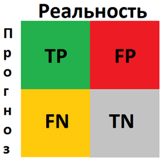
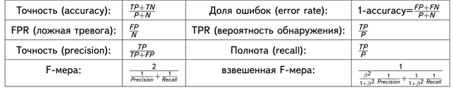
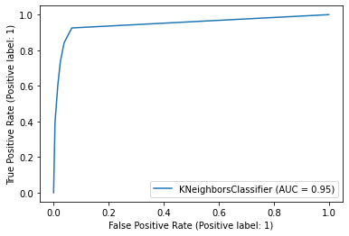
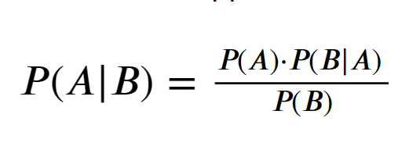

# Классификация
Предсказываем значение из конечного множества 

**Типы признаков**

* **бинарный**: D_j = {0, 1};
* **вещественный**: D_j из {R};
* **категориальный**: D_j -- конечное неупорядоченное множество;
* **порядковый**: D_j --  конечное упорядоченное множество;
* ***множествозначный***: D_j -- подмножество некоторого множества.

В качестве целевого признака в задаче классификации обычно выступают: бинарный, категориальный, порядковый

# Предобработка
> см. ветку 1-Preprocessing

# Метод k-ближайших соседей
Простейший метрический классификатор, основанный на оценивании сходства объектов. Классифицируемый объект относится к тому классу, которому принадлежат ближайшие к нему объекты обучающей выборки.
**Обучение**
В самом простом варианте стадии обучения как таковой нет. Она заключается в сохранении обучающей выборки внутри модели. 
**Предсказание**
Состоит из следующих этапов:
1. На основе функции расстояния (метрики) осортировать объекты по удалённости от классифицируемого;
2. Выбрать k ближайших объектов из отсортированной обучающей выборки;
3. Оценить принадлежность по этим k объектам.

```python
from sklearn.neighbors import KNeighborsClassifier
```
X_train : array-like of shape (n_samples, n_features) -- training data. 

y_train : array-like of shape (n_samples,) -- target values.
```python
knn = KNeighborsClassifier(n_neighbors=5, p=2)
knn.fit(X_train, y_train)
```
X_test : array-like of shape(n_test_samples, n_features) -- test data
```python
y_bin_knn_pred = knn.predict(X_test)
```
Сохранив предсказания в y_bin_knn_pred, можем оценить их качество:
# Метрики

Для оценки качетсва моделей классификации применяются следующие метрики:

accuracy -- (количество верно классифицированных объектов) / (общее количество объектов)
```python
from sklearn.metrics import accuracy_score
accuracy_score(y_test, y_bin_knn_pred)
```

- Confusion matrix



```python
from sklearn.metrics import confusion_matrix
confusion_matrix(y_test, y_bin_knn_pred)
```
- Precision, Recall, F-мера  

P  – число истинных результатов, P=TP+FN
N – число ложных результатов, N=TN+FP.



```python
from sklearn.metrics import classification_report
print(classification_report(y_test, y_bin_knn_pred))
```
- ROC-AUC score  
Полное название ROC — Receiver Operating Characteristic (рабочая характеристика приёмника). Впервые она была создана для использования радиолокационного обнаружения сигналов во время Второй мировой войны. США использовали ROC для повышения точности обнаружения японских самолетов с помощью радара. Поэтому ее называют рабочей характеристикой приемника.
AUC или area under curve — это просто площадь под кривой ROC.
True Positive Rate (TPR) показывает, какой процент среди всех positive верно предсказан моделью. TPR=TP/(TP+FN)
False Positive Rate (FPR): какой процент среди всех negative неверно предсказан моделью. FPR=FP/(TP+FN)

```python
import matplotlib.pyplot as plt
from sklearn.metrics import plot_roc_curve
plot_roc_curve(knn, X_test, y_test)
```


# Байес
**Формула Байеса**


* P(A)  -- априорная вероятность гипотезы A;
* P(A|B) --  вероятность гипотезы A при наступлении события B (апостериорная вероятность);
* P(B|A) --  вероятность наступления события B при истинности гипотезы A;
* P(B) -- полная вероятность наступления события B.

```python
# https://scikit-learn.org/stable/modules/naive_bayes.html
from sklearn.naive_bayes import GaussianNB


gnb = GaussianNB()
gnb.fit(X_train, y_train)
y_pred = gnb.predict(X_test)
print(classification_report(y_test, y_pred))
```

# Логистическая регрессия

```python
# https://scikit-learn.org/stable/modules/generated/sklearn.linear_model.LogisticRegression.html
from sklearn.linear_model import LogisticRegression


clf = LogisticRegression(random_state=0).fit(X_train, y_train)
y_pred = clf.predict(X_test)
print(classification_report(y_test, y_pred))
```

# SVM (support vector machine, машина опорных векторов)
Основная идея метода — перевод исходных векторов в пространство более высокой размерности и поиск разделяющей гиперплоскости с наибольшим зазором в этом пространстве. Две параллельных гиперплоскости строятся по обеим сторонам гиперплоскости, разделяющей классы. Разделяющей гиперплоскостью будет гиперплоскость, создающая наибольшее расстояние до двух параллельных гиперплоскостей. Алгоритм основан на допущении, что чем больше разница или расстояние между этими параллельными гиперплоскостями, тем меньше будет средняя ошибка классификатора.

```python
# https://scikit-learn.org/stable/modules/svm.html
from sklearn import svm

clf = svm.SVC()
clf.fit(X_train, y_train)

y_pred = clf.predict(X_test)
print(classification_report(y_test, y_pred))
```