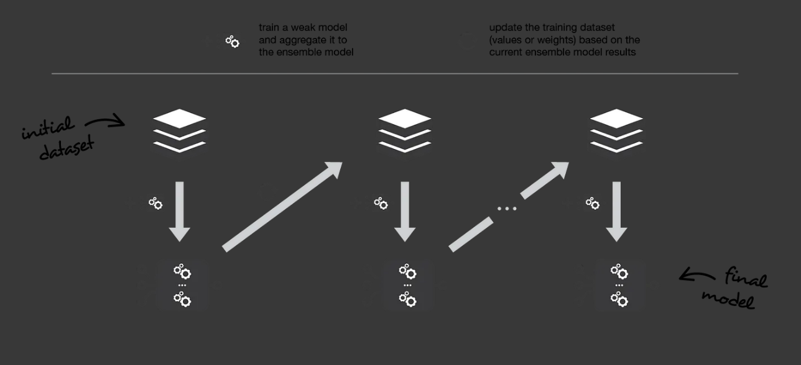
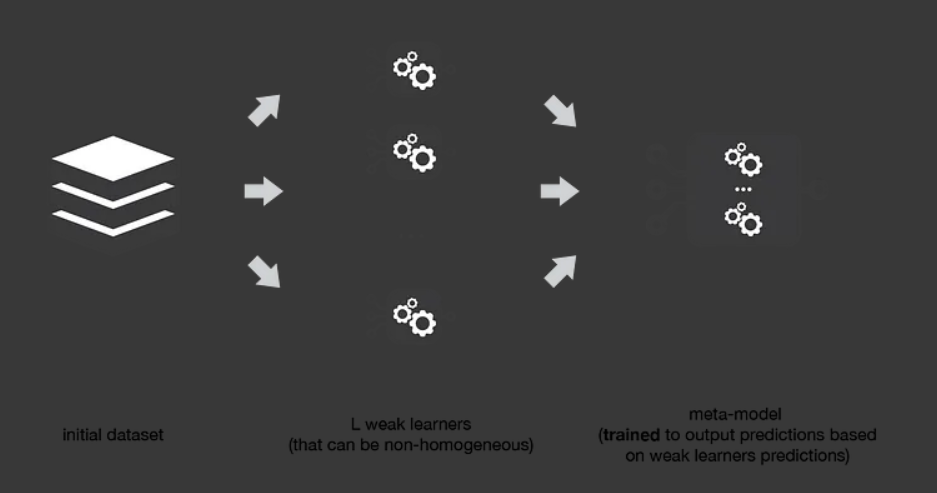

# Ансамбли

Ансамблирование - это метод построения композиции моделей машинного обучения, который позволяет объединить несколько моделей в единую силульную модель. В результате ансамблирования достигается более высокая точность предсказаний и уменьшается вероятность переобучения. Существует несколько типов ансамблей, таких как бэггинг, бустинг, стекинг и другие.

## Гиперпараметры

* *n_estimators* - количество моделей в ансамбле 
* *base_estimator* - тип базовых моделей 
* *max_depth* - глубина деревьев в случайном лесу
* *max_features* - количество признаков, используемых для построения каждого дерева
* *criterion* - критерий разделения для деревьев
* *learning_rate* - скорость обучения для градиентного бустинга.

## Бэггинг
* Бэггинг (Bootstrap Aggregating) - метод построения композиции моделей, при котором каждая модель обучается на случайной подвыборке данных с повторениями. Затем результаты всех моделей усредняются.


* Случайный лес (Random Forest) - это метод бэггинга для деревьев решений.

### Использование модели

#### Для классификации
```python
from sklearn.ensemble import BaggingClassifier
from sklearn.tree import DecisionTreeClassifier

base_estimator = DecisionTreeClassifier() # базовая модель - дерево решений для классификации

bagging_classifier = BaggingClassifier(base_estimator=base_estimator, n_estimators=10, max_samples=0.5, max_features=0.5) # модель бэггинга для классификации
bagging_classifier.fit(X_train, y_train) # обучение
y_pred = bagging_classifier.predict(X_test) # предсказанные значения
```
#### Для регрессии
```python
from sklearn.ensemble import BaggingRegressor
from sklearn.tree import DecisionTreeRegressor

base_estimator = DecisionTreeRegressor(max_depth=5) # базовая модель - дерево решений для регрессии

bag_reg = BaggingRegressor(base_estimator=base_estimator, n_estimators=10, random_state=42) # модель бэггинга для регрессии
bag_reg.fit(X_train, y_train) # обучение
y_pred = bag_reg.predict(X_test) # предсказанные значения
```

## Бустинг
* Бустинг (Boosting) - метод последовательного построения композиции моделей, при котором каждая следующая модель добавляется таким образом, чтобы исправить ошибки предыдущих моделей.



* Градиентный бустинг (Gradient Boosting) - это метод бустинга, который использовался для прогнозирования задач регрессии и классификации.

* Стохастический градиентный бустинг (Stochastic Gradient Boosting) - это метод градиентного бустинга, который работает с использованием случайно выбранных подмножеств признаков и объектов.

### Использование модели Gradient Boosting

#### Для классификации
```python
from sklearn.ensemble import GradientBoostingClassifier

model = GradientBoostingClassifier(n_estimators=100, learning_rate=0.1, max_depth=3, random_state=42) # модель
model.fit(X_train, y_train) # обучение
y_pred = model.predict(X_test) # предсказанные значения
```
#### Для регрессии
```python
from sklearn.ensemble import GradientBoostingRegressor

model = GradientBoostingRegressor(n_estimators=100, learning_rate=0.1, max_depth=3, random_state=42) # модель
model.fit(X_train, y_train) # обучение
y_pred = model.predict(X_test) # предсказанные значения
```

## **Также еще существуют 3 различных алгоритма градиентного бустинга - CatBoost, XGBoost, и LightGBM.**

#### Пример использования CatBoost для классификации:
```python
from catboost import CatBoostClassifier

# Создаем и обучаем модель CatBoost
clf = CatBoostClassifier()
clf.fit(X_train, y_train)

# Оцениваем качество модели на тестовых данных
accuracy = clf.score(X_test, y_test)
print(f"Accuracy: {accuracy:.2f}")
```
#### Пример использования CatBoost для регрессии:
```python
from catboost import CatBoostRegressor

# Создаем и обучаем модель CatBoost
reg = CatBoostRegressor()
reg.fit(X_train, y_train)

# Оцениваем качество модели на тестовых данных
mse = reg.score(X_test, y_test)
print(f"MSE: {mse:.2f}")
```

#### Пример использования XGBoost для классификации:
```python
from xgboost import XGBClassifier

# Создаем и обучаем модель XGBoost
clf = XGBClassifier()
clf.fit(X_train, y_train)

# Оцениваем качество модели на тестовых данных
accuracy = clf.score(X_test, y_test)
print(f"Accuracy: {accuracy:.2f}")
```
#### Пример использования XGBoost для регрессии:
```python
from xgboost import XGBRegressor

# Создаем и обучаем модель XGBoost
reg = XGBRegressor()
reg.fit(X_train, y_train)

# Оцениваем качество модели на тестовых данных
mse = reg.score(X_test, y_test)
print(f"MSE: {mse:.2f}")
```

#### Пример использования LightGBM для классификации:
```python
import lightgbm as LGBMClassifier

# Создаем модель LGBMClassifier
clf = LGBMClassifier(boosting_type='gbdt', num_leaves=31, max_depth=-1, learning_rate=0.05, n_estimators=100)

# Обучаем модель на данных для обучения
clf.fit(X_train, y_train, eval_set=[(X_test, y_test)], early_stopping_rounds=10)

# Оцениваем качество модели на данных для тестирования
accuracy = clf.score(X_test, y_test)
print(f"Accuracy: {accuracy:.2f}")
```
#### Пример использования LightGBM для классификации:
```python
import lightgbm as LGBMRegressor

# Создаем модель LGBMRegressor
reg = LGBMRegressor(boosting_type='gbdt', num_leaves=31, max_depth=-1, learning_rate=0.05, n_estimators=100)

# Обучаем модель на данных для обучения
reg.fit(X_train, y_train, eval_set=[(X_test, y_test)], early_stopping_rounds=10)

# Оцениваем качество модели на данных для тестирования
mse = reg.score(X_test, y_test)
print(f"MSE: {mse:.2f}")
```


## Стекинг
* Стекинг (Stacking) - метод, при котором несколько моделей первого уровня предсказывают значения, которые затем используются в качестве входных параметров для модели второго уровня.



### Использование модели

#### Для классификации
```python
from sklearn.ensemble import StackingClassifier
from sklearn.linear_model import LogisticRegression
from sklearn.svm import SVC
from sklearn.naive_bayes import GaussianNB
from sklearn.metrics import accuracy_score

# Создание базовых моделей
estimators = [
    ("lr", LogisticRegression()),
    ("svc", SVC(probability=True)),
    ("nb", GaussianNB())
]

# Создание модели StackingClassifier
model = StackingClassifier(estimators=estimators,
                           final_estimator=LogisticRegression(),
                           cv=5) # финальный классификатор здесь логистическая регрессия

# Обучение модели на обучающей выборке
model.fit(X_train, y_train)

# Прогнозирование классов на тестовой выборке
y_pred = model.predict(X_test)

# Оценка точности модели
accuracy = accuracy_score(y_test, y_pred)
```
#### Для регрессии
```python
from sklearn.ensemble import StackingRegressor
from sklearn.linear_model import LinearRegression, Ridge
from sklearn.tree import DecisionTreeRegressor

# Создаем базовые модели
estimators = [
    ('lr', LinearRegression()),
    ('ridge', Ridge(alpha=1.0)),
    ('dt', DecisionTreeRegressor(max_depth=5))
]

# Создаем мета-модель
stacked_regressor = StackingRegressor(
    estimators=estimators,
    final_estimator=Ridge(alpha=0.5)
)

# Обучаем модель на тренировочных данных
stacked_regressor.fit(X_train, y_train)

# Оцениваем модель на тестовых данных
score = stacked_regressor.score(X_test, y_test)
```
